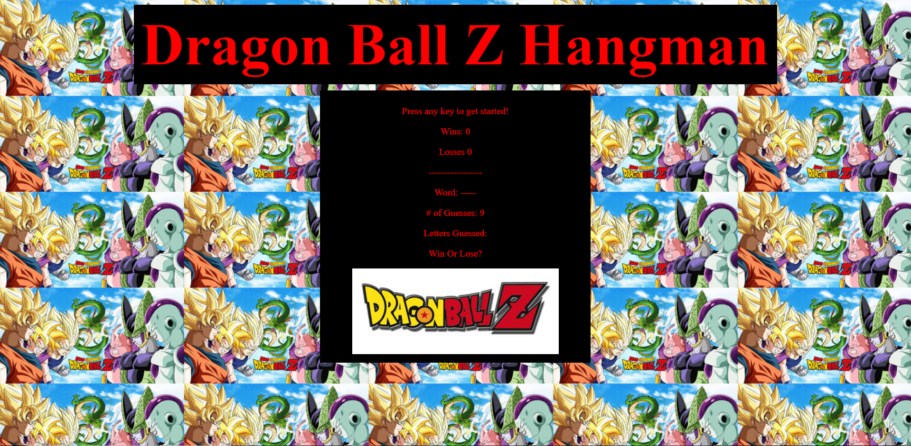

# Word-Guess-Game

[Link to the Hangman Website](https://darryljltolentino.github.io/Word-Guess-Game/)

This is a website that features a hangman game that requires the user to press letters on a keyboard to try to guess a word, which is denoted by dashes. The user has 9 attempts to guess a correct letter or number. If the user chooses a letter or number that is within the word, then the word section will replace dashes where the correct letter or number is and then the user can then choose another letter or number. If the user chooses a wrong letter or number, then the number of guesses will go down by one and the user can then choose another letter or number. There is also a section that lists the letters and numbers that the user has already picked. If the user chooses a letter or number that they have picked already or a non-letter and non-number key on the keyboard, the game will wait for an appropriate key press. When the user either guesses the entire word correctly or incorrectly, an image of the character will appear if correct and a picture of Goku injured will appear if incorrect as well as text that denotes winning or losing. All the logic of the game was coded with JavaScript, while the styling and basic layout of the game was coded in HTML and CSS.